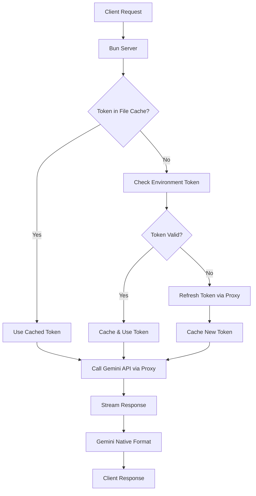

# 🚀 Gemini CLI as API

[](https://www.buymeacoffee.com/gewoonjaap)

Google's Gemini models Native API using Bun runtime. Access Google's most advanced AI models through Gemini-native API patterns, powered by OAuth2 authentication and the same infrastructure that drives the official Gemini CLI.

이 프로젝트는 https://github.com/GewoonJaap/gemini-cli-openai 를 기반으로 만들어졌습니다.

## ✅ Tested On

This API has been successfully tested with:
- **Direct Connection**:
  - 🤖 Roo Code
- **Through LiteLLM**:
  - 👨‍💻 GitHub Copilot
  - 🔮 Cursor

## ✨ Features

- 🔐 **OAuth2 Authentication** - No API keys required, uses your Google account
- 🎯 **Gemini-Native API** - Native endpoints for Google Gemini models
- 🖼️ **Vision Support** - Multi-modal conversations with images (base64 & URLs)
- 🔧 **Tool Calling Support** - Function calling with Gemini API integration
- 🧠 **Advanced Reasoning** - Support for Gemini's thinking capabilities with effort controls
- 🛡️ **Content Safety** - Configurable Gemini moderation settings
- ⚡ **Bun Runtime** - Fast TypeScript execution with native HTTP proxy support
- 🔄 **Smart Token Caching** - Intelligent token management with file-based storage
- 🆓 **Free Tier Access** - Leverage Google's free tier through Code Assist API
- 📡 **Real-time Streaming** - Server-sent events for live responses
- 🎭 **Multiple Models** - Access to latest Gemini models including experimental ones
- 🐳 **Docker Ready** - Production-ready multi-stage Docker builds

## 🤖 Supported Models

| Model ID | Context Window | Max Tokens | Thinking Support | Description |
|----------|----------------|------------|------------------|-------------|
| `gemini-3-pro-preview` | 1M | 65K | ✅ | Google's Gemini 3.0 Pro Preview model |
| `gemini-3-flash-preview` | 1M | 65K | ✅ | Google's Gemini 3.0 Flash Preview model |
| `gemini-2.5-pro` | 1M | 65K | ✅ | Latest Gemini 2.5 Pro model with reasoning capabilities |
| `gemini-2.5-flash` | 1M | 65K | ✅ | Fast Gemini 2.5 Flash model with reasoning capabilities |
| `gemini-2.5-flash-lite` | 1M | 65K | ✅ | Lightweight version of Gemini 2.5 Flash model with reasoning capabilities |

## 🛠️ Setup

### Prerequisites

1. **Google Account** with access to Gemini
2. **Docker** and **Docker Compose** installed (for containerized deployment)
3. **Bun** installed (optional, for local development: `curl -fsSL https://bun.sh/install | bash`)

### Step 1: Get OAuth2 Credentials

You need OAuth2 credentials from a Google account that has accessed Gemini. The easiest way to get these is through the official Gemini CLI.

#### Using Gemini CLI

1. **Install Gemini CLI**:
   ```bash
   npm install -g @google/gemini-cli
   ```

2. **Start the Gemini CLI**:
   ```bash
   gemini
   ```

3. **Authenticate with Google**:
   
   Select `● Login with Google`.
   
   A browser window will now open prompting you to login with your Google account.
   
4. **Locate the credentials file**:
   
   **Windows:**
   ```
   C:\Users\USERNAME\.gemini\oauth_creds.json
   ```
   
   **macOS/Linux:**
   ```
   ~/.gemini/oauth_creds.json
   ```

5. **Copy the credentials**:
   The file contains JSON in this format:
   ```json
   {
     "access_token": "ya29.a0AS3H6Nx...",
     "refresh_token": "1//09FtpJYpxOd...",
     "scope": "https://www.googleapis.com/auth/cloud-platform ...",
     "token_type": "Bearer",
     "id_token": "eyJhbGciOiJSUzI1NiIs...",
     "expiry_date": 1750927763467
   }
   ```

### Step 2: Configure Environment Variables

Create a `.dev.vars` file in the project root:

```bash
# Required: OAuth2 credentials JSON from Gemini CLI authentication
GCP_SERVICE_ACCOUNT={"access_token":"ya29...","refresh_token":"1//...","scope":"...","token_type":"Bearer","id_token":"eyJ...","expiry_date":1750927763467}

# Optional: API key for authentication (if not set, API is public)
# When set, clients must include "x-goog-api-key: <your-api-key>" header
GEMINI_API_KEY=your-secret-api-key-here

# Optional: Google Cloud Project ID (auto-discovered if not set)
GEMINI_PROJECT_ID=your-project-id

# Optional: Enable automatic model fallback on rate limits (429/503)
ENABLE_AUTO_MODEL_SWITCHING=true

# Optional: HTTP Proxy (if needed)
HTTP_PROXY=http://proxy-host:port
```

### Step 3: Run with Docker (Recommended)

```bash
# Build and start the container
docker-compose up -d

# View logs
docker-compose logs -f

# Stop the container
docker-compose down
```

The API will be available at `http://localhost:8787`

### Step 4: Run Locally (Development)

```bash
# Install dependencies
bun install

# Run in development mode
bun run dev
```

## 📡 API Endpoints

### Base URL
```
http://localhost:8787
```

### List Models
```http
GET /gemini/models
```

**Response:**
```json
{
  "models": [
    {
      "name": "models/gemini-3-pro-preview",
      "displayName": "gemini-3-pro-preview",
      "description": "Google's Gemini 3.0 Pro Preview model",
      "inputTokenLimit": 1000000,
      "outputTokenLimit": 65536,
      "supportedGenerationMethods": ["generateContent", "streamGenerateContent"]
    }
  ]
}
```

### Generate Content
```http
POST /gemini/models/{model}:generateContent
Content-Type: application/json

{
  "contents": [
    {
      "role": "user",
      "parts": [{ "text": "Hello, how are you?" }]
    }
  ]
}
```

### Stream Generate Content
```http
POST /gemini/models/{model}:streamGenerateContent
Content-Type: application/json

{
  "contents": [
    {
      "role": "user",
      "parts": [{ "text": "Tell me a story" }]
    }
  ]
}
```

## 🏗️ How It Works



## 🔄 Automatic Model Fallback

The API supports automatic fallback to faster/lighter models when the primary model hits rate limits (429) or service unavailability (503).

### How it works:
1. If a request to a Pro model fails with a 429 or 503 error
2. The system checks if `ENABLE_AUTO_MODEL_SWITCHING=true` is set
3. It automatically retries the request using a pre-configured Flash model
4. A notification message is prepended to the response to inform the user about the switch

### Default Mappings:
- `gemini-3-pro-preview` → `gemini-3-flash-preview`
- `gemini-2.5-pro` → `gemini-2.5-flash`

## 🐳 Docker Architecture

### Multi-stage Build
- **Build Stage**: Installs dependencies and prepares source code
- **Production Stage**: Minimal Alpine-based image with Bun runtime
- **Size**: ~150-200MB (vs 2.7GB with Node.js)
- **Memory**: ~1.5GB per instance (vs 3.4GB)

### Proxy Support
- Uses `undici` ProxyAgent for HTTP_PROXY support
- No iptables/redsocks complexity
- Works seamlessly with corporate proxies

## 🔧 Development

```bash
# Install dependencies
bun install

# Run locally
bun run dev

# Format code
bun run format

# Lint code
bun run lint
```

## 📄 License

This codebase is provided for personal use and self-hosting only.

## 🙏 Credits

Based on [gemini-cli-openai](https://github.com/GewoonJaap/gemini-cli-openai) by GewoonJaap.
